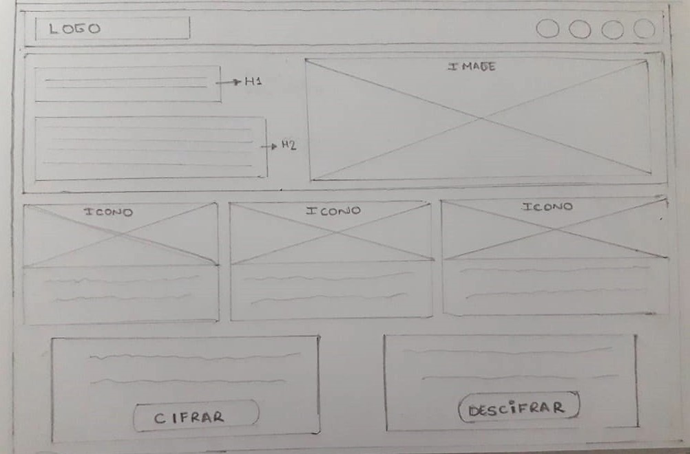

# Cyberhack

## OBJETIVO DEL PROYECTO
Crear una web que pueda solucionar un problema de la necesidad del usuario usando el algoritmo de cifrar y decifrar.

### Metodo para cifrar

Cifrar significa codificar. El [cifrado César](https://en.wikipedia.org/wiki/Caesar_cipher) es uno de los primeros métodos de cifrado conocidos. El emperador romano Julio César lo usaba para enviar órdenes secretas a sus generales en los campos de batalla.

El cifrado césar es una de las técnicas más simples para cifrar un mensaje. Es un tipo de cifrado por sustitución, es decir que cada letra del texto original es reemplazada por otra que se encuentra un número fijo de posiciones (desplazamiento) más adelante en el mismo alfabeto.

Por ejemplo, si usamos un desplazamiento (_offset_) de 3 posiciones:

- La letra A se cifra como D.
- La palabra CASA se cifra como FDVD.
- Alfabeto sin cifrar: A B C D E F G H I J K L M N O P Q R S T U V W X Y Z
- Alfabeto cifrado: D E F G H I J K L M N O P Q R S T U V W X Y Z A B C

En la actualidad, todos los cifrados de sustitución simple se descifran con mucha facilidad y, aunque en la práctica no ofrecen mucha seguridad en la comunicación por sí mismos; el cifrado César sí puede formar parte de sistemas más complejos de codificación, como el cifrado Vigenère, e incluso tiene aplicación en el sistema ROT13.

## DESCRIPCION DEL PROYECTO

Es una aplicacion web que te ayuda a crear claves y/o contraseñas secretas dificiles de hackear, donde puedes usar diferentes caracteres del alfabeto(mayusculas y minusculas) y que no hay limites de extension al crear tus contraseñas.

## INTRODUCCION A LA APLICACION

### EJECUTAR LA APLICACION
1. Abre la app de [Github](https://github.com/).
2. Buscar el contenido o el nombre de la app **(Cyberhack)**.
3. Seleccionar la aplicacion desde el Github.
4. Ejecutar la aplicacion en la pagina web para poder visualizarla.

## DEFINICION DEL PRODUCTO

### Estudio de la necesidad del usuario

Hoy en dia la mayoria de los usuarios que navegan por el internet manejan cuentas, correos, paginas y redes sociales usando contraseñas debiles e inseguras que al mismo tiempo estan expuestos a los riesgos de ser hackeado en menos de un segundo. Los usuarios que mas estan expuestos a estos riesgos son los jovenes y jovenes adultos de un rango de 18 - 45 años, ya que pasan el mayor tiempo en contacto con la tecnologia digital. Es por ello que como recomendacion de seguridad al crear una contraseña segura es utilizando minusculas y mayusculas, o que a la vez sean frases o mensajes extensos que no estesn relacionados con los datos personales del usuario.

### Objetivos del usuario

- Seguridad al crear contraseñas fuertes y dificiles de hackear.
- Al crear contraseñas dificiles de descifrar hace que no puedan acceder a la informacion personal del usuario.
- Crear diferentes contraseñas dificiles de descifrar evita que puedan acceder a todas sus cuentas personales si tuvieran la misma contraseña en todas ellas.

## FUNCIONALIDAD DE LA PAGINA

La aplicacion de la pagina web tiene la funcionalidad de cifrar el mensaje y/o contraseña que el usuario ingresa, usando un desplazamiento (offset) que tiene como funcion sustituir el mensaje original que se encuentra en un numero de fijo de posiciones por otro carateres del alfabeto. A la vez tambien cuenta con la funcion de descifrar que te devuelve el mensaje original ingresando el mensaje cifrado y el desplazamiento utilizado al cifrar el mensaje.

## DISEÑO DE LA PAGINA
Para crear la aplicacion de la pagina web diseñe un prototipo de diseño que contiene:

### Ideacion
En este proceso de de crear el diseño de la pagina web me pude enfocar en que los usuarios tengan la facilidad de poder ingresar a la aplicacion y que tenga un apagina prinipal para que se pueda dar a conocer mejor la aplicacion.

### Prototipado

#### MAQUETACION
 : Primera Maquetacion

 : Segunda Maquetacion

#### COLORES
Para definir los colores de mi pagina utilice las siguientes fuentes:
* [cerotec](https://www.cerotec.net/tabla-colores-web/)
* [HTML Colores](https://htmlcolorcodes.com/es/)

**Paletas de colores**

  

#### TIPOGRAFIAS
**Fuentes**
* [Google Fonts](https://fonts.google.com/)

#### PRIMER DISEÑO

![Imagen3][3] ![Imagen4][4]

[3]: src/imagenes/captura3.PNG
[4]: src/imagenes/captura4.PNG

#### DISEÑO FINAL

![Imagen5][5] ![Imagen6][6] ![Imagen7][7] ![Imagen8][8] ![Imagen9][9] ![Imagen10][10]

[5]: src/imagenes/captura5.PNG
[6]: src/imagenes/captura6.PNG
[7]: src/imagenes/captura7.PNG
[8]: src/imagenes/captura8.PNG
[9]: src/imagenes/captura9.PNG
[10]: src/imagenes/captura10.PNG

### Interfaz de usuario (UI)

La interfaz permite al usuario:
- Elegir un desplazamiento (_offset_) indicando cuántas posiciones queremos que el cifrado desplace cada caracter.
- Insertar un mensaje y/o contraseña (texto) que queremos cifrar.
- Ver el resultado del mensaje cifrado.
- Insertar un mensaje (texto) a descifrar.
- Ver el resultado del mensaje descifrado.

### Desarrollo Front-end:

* Valores
* Tipos
* Variables
* Control de flujo
* Tests unitarios

### Herramientas:
- GitHub y GitHub Pages.
- [Guía de Scrum](https://www.scrumguides.org/docs/scrumguide/v1/scrum-guide-es.pdf): solamente para comenzar a entender cómo organizar tu trabajo.
